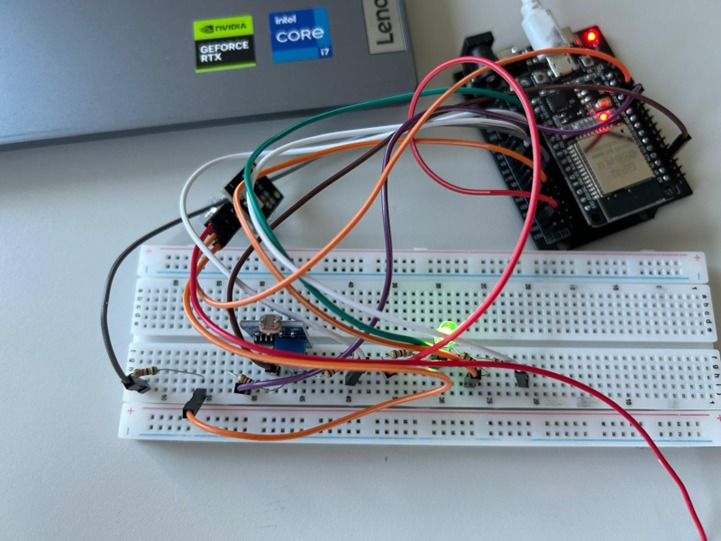
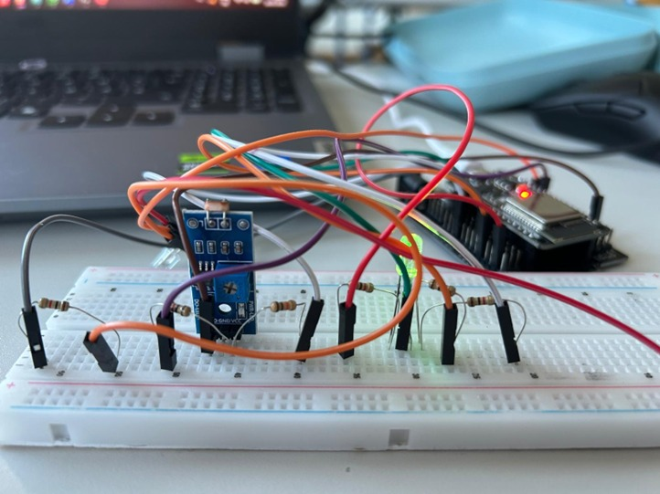

# SYT-Projekt: Drahtlose Sensor-Erfassung & Smart-Aktorik via ESP-NOW

**Verfasser:** Osman Güngür, Krystian Kluska 
**Klasse:** [Eure Klasse eintragen, z.B. 4AHIT]  
**Datum:** 26.05.2026  
**Fach:** Systemtechnik (SYT)  

---

## 1. Einführung & Zielsetzung
In der modernen Automatisierungstechnik und im Internet of Things (IoT) spielt die effiziente, drahtlose Datenübertragung zwischen Kleinstgeräten eine zentrale Rolle. Häufig wird hierfür auf klassische WLAN-Verbindungen über einen zentralen Router zurückgegriffen, was jedoch zu Latenzen und erhöhtem Energieverbrauch führt. 

Das von Espressif entwickelte **ESP-NOW-Protokoll** bietet hier eine ressourcenschonende Alternative, da es eine direkte Peer-to-Peer-Kommunikation ohne Accesspoint ermöglicht. Im Rahmen dieses Projekts wird eine Sensor-Aktor-Infrastruktur auf Basis zweier ESP32-Mikrocontroller realisiert, welche Umgebungshelligkeit und Objekterkennung im Raum überwacht und via Webinterface steuerbar macht.

---

## 2. Systemarchitektur & Projektbeschreibung
Das verteilte IoT-System besteht aus zwei autarken ESP32-Knoten, die drahtlos miteinander interagieren:

* **Die Sender-Station (ESP1):** Erfasst zyklisch die Werte eines analogen Lichtsensors (LDR) sowie eines Infrarot-Näherungssensors (IR). Ein Software-Filter bereinigt das Signal des Lichtsensors. Zudem steuert der Sender direkt eine RGB-LED zur lokalen Statusanzeige an.
* **Die Empfänger-Station (ESP2):** Empfängt die strukturierten Sensordaten im Hintergrund, verarbeitet diese und stellt die Messwerte über ein responsives HTTP-Webinterface zur Verfügung. Das Webinterface bietet neben der Live-Überwachung einen automatischen sowie manuellen Steuerungsmodus mit dynamischer UI-Anpassung (Hell/Dunkel-Theme).

---

## 3. Technische Theorie

### ESP-NOW Protokoll
ESP-NOW ist ein verbindungsloses Kommunikationsprotokoll von Espressif, das auf der 2,4-GHz-Frequenz arbeitet. Es überspringt den zeit- und energieaufwendigen Handshake-Prozess eines Standard-Wi-Fi-Verbindungsaufbaus. Dadurch können Datenpakete extrem schnell ($\le$ 1 ms Latenz) und mit minimalem Strombedarf übertragen werden.

### Sensorik und Signalverarbeitung
1. **LDR-Lichtsensor (Fotowiderstand):** Liefert ein analoges Signal basierend auf der Umgebungshelligkeit. Um hochfrequentes Signalrauschen zu minimieren, wird im Code ein gleitender Mittelwertfilter über 10 Samples angewendet.
2. **Infrarot-Näherungssensor (IR):** Arbeitet digital als *Active-Low*-Sensor. Sobald sich ein Objekt im Sichtfeld befindet, schaltet der Pin auf `LOW`.
3. **RGB-LED (Common Anode):** Da die LED eine gemeinsame Anode besitzt, wird sie mit invertierter Logik angesteuert ($255 - \text{Farbwert}$).

---

## 4. Hardware-Spezifikation & Pinbelegung

### Komponentenliste
| Anzahl | Komponente | Beschreibung / Funktion |
| :--- | :--- | :--- |
| 2x | ESP32 NodeMCU Development Board | Haupt-Mikrocontroller (Sender & Empfänger) |
| 1x | LDR-Lichtsensor-Modul | Analoge Erfassung der Umgebungshelligkeit |
| 1x | Infrarot-Näherungssensor | Digitale Hinderniserkennung (Active-Low) |
| 1x | RGB-LED (Common Anode) | Lokale optische Statusanzeige beim Sender |
| 3x | Vorwiderstände (220 $\Omega$) | Strombegrenzung für die RGB-LED-Kanäle |
| 1x | Steckbrett (Breadboard) | Physischer Versuchsaufbau |
| m. | Jumper-Kabel | Signal- und Stromversorgungsverbindungen |

### Pinbelegung (Sender-Knoten)
* Analoger Lichtsensor &rarr; **GPIO 34** (Analog INPUT)
* Infrarot-Sensor (IR) &rarr; **GPIO 27** (Digital INPUT)
* RGB-LED (Rot) &rarr; **GPIO 22** (OUTPUT, PWM)
* RGB-LED (Grün) &rarr; **GPIO 21** (OUTPUT, PWM)
* RGB-LED (Blau) &rarr; **GPIO 16** (OUTPUT, PWM)

---

## 5. Systemfunktionen & UI-Betrieb

### Lokale Aktorik-Logik (Sender-Knoten)
* **Zustand "Hell":** Die RGB-LED leuchtet dauerhaft **Gelb**.
* **Zustand "Dunkel" (Lichtwert &ge; 200):** Die RGB-LED wechselt auf **Blau**.
* **Ereignis "Objekt erkannt":** Unabhängig von der Helligkeit unterbricht die LED ihren Zustand und **blinkt zweimal kurz**, um Aufmerksamkeit zu generieren.

### Webinterface-Ansichten (Empfänger-Knoten)
* **Automatischer Modus:** Der Webserver wertet das Flag `dunkel` aus. Ist es dunkel, schaltet die Seite ins dunkle CSS-Theme (`#0f172a`), ist es hell, wechselt das Dashboard in das helle CSS-Theme (`#f1f5f9`).
* **Manueller Modus:** Über die Buttons `NACHT EIN` und `NACHT AUS` kann das Verhalten der Anzeige vom User remote überschrieben werden.

---

## 6. Prototypen-Aufbau & Dokumentation

### Schaltplan
*(Erstellt mit Fritzing / Schaltplan-Editor. Bitte die entsprechende Bilddatei ins Repository hochladen)*

### Fotos vom realen Versuchsaufbau
Die folgenden Abbildungen zeigen den physischen Breadboard-Aufbau des Sender-Knotens inklusive Sensorik-Anbindung und Vorwiderständen.

#### Hardware-Aufbau (Top-View)

#### Hardware-Aufbau (Front-View)

